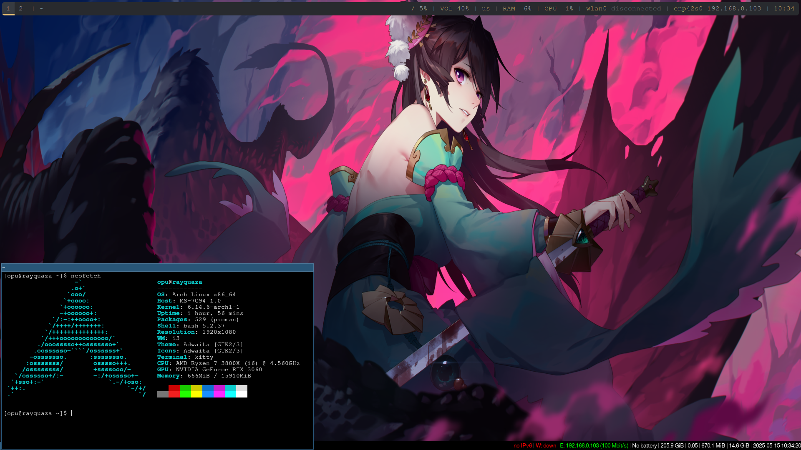

# ⚙️ rayquaza setup

This repository contains my personal dotfiles and configuration for a minimal, clean, and keyboard-driven Arch Linux system using **i3**, **Polybar**, and **PipeWire**. It is optimized for performance, clarity, and reproducibility across devices.

---


## 🚀 Setup Instructions

```bash
git clone git@github.com:yourusername/dotfiles.git ~/dotfiles
cd ~/dotfiles
./setup.sh
```

Or use the Makefile for modular install:

```bash
make install        # Set up everything
make update         # Commit & push changes
make pull           # Pull latest changes
```

---

## 📦 Full Package List

- **i3 Window Manager** – tiling WM for power users
- **Polybar** – status bar with custom modules
- **PipeWire** – next-gen audio server
- **Bluetooth Support** – via BlueZ
- **LightDM** – display manager with GTK greeter
- **Kitty Terminal** – GPU-accelerated terminal emulator
- **Neovim/Vim** – modern text editors
- **Rofi & dmenu** – powerful app launchers
- **Thunar** – lightweight file manager
- **Feh** – wallpaper handler
- **Picom** – compositor for transparency and shadows
- **VSCode** – IDE for development
- **OBS Studio** – screen recording and streaming
- **Neofetch** – system info on terminal launch
- **Maim** – screenshot utility
- **Xss-lock + i3lock** – screen locker on suspend/idle
- **GitHub SSH Setup** – seamless dotfiles syncing
- **zram-generator** – compressed RAM swap

---

To install all dependencies:

```bash
sudo pacman -S --needed - < pkglist.txt
````

Update the list anytime with:

```bash
pacman -Qqe > pkglist.txt
```

---

## 🔁 Sync Across Devices

### Option A: Cron Job (auto-pull dotfiles)

```bash
crontab -e
```

Add:

```bash
*/30 * * * * cd ~/dotfiles && git pull origin main > /dev/null 2>&1
```

### Option B: Aliases

Add to `.bashrc` or `.zshrc`:

```bash
alias dotup="cd ~/dotfiles && make update"
alias dotsync="cd ~/dotfiles && make pull"
```

---

## 💡 Keybindings

| Keybinding        | Action                          |
| ----------------- | ------------------------------- |
| `Mod + Enter`     | Open Kitty terminal             |
| `Mod + D`         | Rofi (app launcher)             |
| `Print`           | Screenshot (maim or grim/slurp) |
| `Mod + Shift + E` | Logout menu                     |
| `Mod + Shift + R` | Reload i3 config                |

*Customize in `~/.config/i3/config`.*

---

## 🔐 SSH Setup for GitHub

```bash
ssh-keygen -t ed25519 -C "your_email@example.com"
eval "$(ssh-agent -s)"
ssh-add ~/.ssh/id_ed25519
```

Copy to GitHub:

```bash
cat ~/.ssh/id_ed25519.pub
```

Test connection:

```bash
ssh -T git@github.com
```

---

## 📷 Screenshots

Use `maim`, `grim`, or `flameshot`:

```bash
maim ~/Pictures/screenshot.png
```

Or bind to the `Print` key in your i3 config.

---

## 🔧 Bluetooth Setup

```bash
sudo systemctl enable --now bluetooth
bluetoothctl
```

In `bluetoothctl`:

```bash
power on
agent on
default-agent
scan on
# pair, trust, connect...
```

---

## 🎯 To-Do / Add-ons

* [ ] Add wallpaper switcher
* [ ] Integrate volume module with Polybar
* [ ] Add `autorandr` for monitor profiles
* [ ] Add notification daemon (like `dunst`)
* [ ] Package custom scripts into `~/dotfiles/scripts/`

---

## 📸 Preview



---

## 📁 Folder Structure

```
dotfiles/
├── i3/
├── polybar/
├── picom/
└── ...
├── pkglist.txt
├── Makefile
├── setup.sh
└── README.md
```

---

## 📚 Credits & Inspirations

* [Arch Wiki](https://wiki.archlinux.org/)
* [r/unixporn](https://www.reddit.com/r/unixporn/)
* DistroTube, Luke Smith, ChrisTitusTech

```

---

You're all set. Copy this into your `README.md`, and your dotfiles repo will look 🔥 on GitHub. Let me know if you want to auto-detect monitor setup or add some shell functions too!
```
